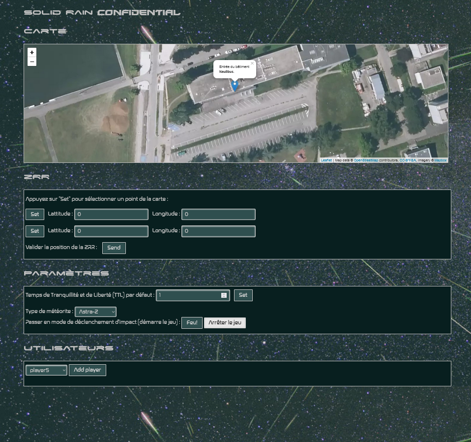
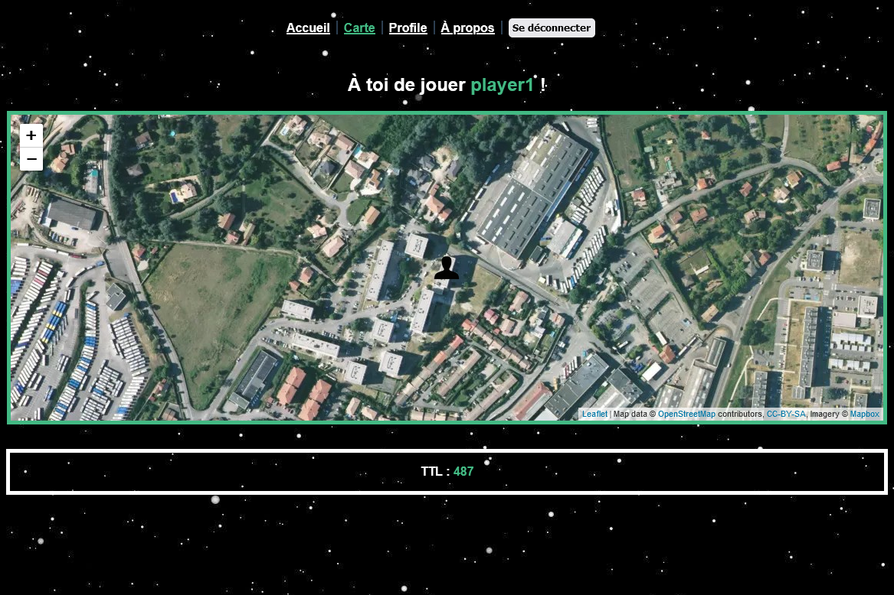

<div id="top"></div>

<!-- PROJECT LOGO -->
<h1 align="center">
  <p>Solid Rain</p>
  
</h1>

<div align="center">
  <p align="center">
   Jeu multijoueur web mobile avec carte, développé dans le cadre de <a href="http://offre-de-formations.univ-lyon1.fr/%2Fue-16777-143%2Fweb-avance-et-web-mobile.html">M1IF13 - Web avancé, Web Mobile</a>
    <br/>
    <br/>
    <a href="https://forge.univ-lyon1.fr/m1if13/m1if13-2021/">Projet 2021</a>
  </p>
</div>

<br/>

<div align="center"> </div>
  
Table des matières
<ol>
  <li>
    <a href="#gestion-des-utilisateurs">Gestion des utilisateurs</a>
    <ul>
      <li><a href="#stack-technique-i">Stack technique (i)</a></li>
      <li><a href="#fonctionnalités-i">Fonctionnalités (i)</a></li>
      <li><a href="#démarrage-i">Démarrage (i)</a></li>
    </ul>
  </li>
  <li>
    <a href="#gestion-du-jeu">Gestion du jeu</a>
    <ul>
      <li><a href="#stack-technique-ii">Stack technique (ii)</a></li>
      <li><a href="#fonctionnalités-ii">Fonctionnalités (ii)</a></li>
      <li><a href="#démarrage-ii">Démarrage (ii)</a></li>
    </ul>
  </li>
  <li>
    <a href="#clients">Clients</a>
    <ul>
      <li><a href="#administrateur">Administrateur</a></li>
      <ul>
        <li><a href="#stack-technique-iii">Stack technique (iii)</a></li>
        <li><a href="#démarrage-iii">Démarrage (iii)</a></li>
      </ul>
      <li><a href="#joueur">Joueur</a></li>
      <ul>
        <li><a href="#stack-technique-iv">Stack technique (iv)</a></li>
        <li><a href="#démarrage-iv">Démarrage (iv)</a></li>
      </ul>
    </ul>
  </li>
  <li><a href="#auteurs">Auteurs</a></li>
</ol>

## Gestion des utilisateurs

### Stack technique (i)

- Java
- [Spring Boot](https://spring.io/projects/spring-boot)
- [OpenAPI](https://swagger.io/specification/)
- [Swagger](https://swagger.io/)
- JUnit

<p align="right">(<a href="#top">back to top</a>)</p>

### Fonctionnalités (i)

- Création / Suppression d'utilisateurs
- Mis à jour du mot de passe
- Connexion / Déconnexion
- Authentification
- Afficher un ou plusieurs utilisateurs

<p align="right">(<a href="#top">back to top</a>)</p>

### Démarrage (i)

1. Ouvrir le dossier `/users` avec un IDE Java (IntelliJ par exemple).
2. Lancer l'application avec la classe `UsersApplications`.
3. L'API est ensuite diponible à l'URL http://localhost:8080.

- Tester le serveur : http://localhost:8080/index.html
- Voir la [documentation](http://localhost:8080/swagger-ui/index.html?configUrl=/api-docs/swagger-config)

Par défaut, la liste des utilisateurs (sous la forme login/password) :

- player1/player1
- player2/player2
- player3/player3
- player4/player4
- player5/player5

<p align="right">(<a href="#top">back to top</a>)</p>

## Gestion du jeu

### Stack technique (ii)

- [npm](https://www.npmjs.com/)
- [Node.js](https://nodejs.org/en/)
- [Express.js](https://expressjs.com/fr/)
- [Jasmine](https://jasmine.github.io/)

<p align="right">(<a href="#top">back to top</a>)</p>

### Fonctionnalités (ii)

Partie administrateur :

- Afficher tous les joueurs
- Ajouter un joueurs
- Afficher les paramètres d'un joueur
- Mettre à jour les paramètre d'un joueur
- Créer une météorite
- Indiquer quand et par quel joueur une météorite a été récupérée
- Afficher l'état de la partie
- Démarrer / Arrêter la partie
- Fixer le périmètre du jeu

Partie jeu :

- Afficher la liste de toutes les météorites
- Mettre à jour la position d'un joueur
- Afficher un joueur grâce à son ID
- Mettre à jour l'image de profil d'un joueur
- Supprimer une météorite

<p align="right">(<a href="#top">back to top</a>)</p>

### Démarrage (ii)

1. Se placer dans le dossier `/api`.

```shell
> cd api
```

2. Installer les dépendances.

```shell
> npm install
```

3. Lancer le serveur.

```shell
> npm run dev
```

4. L'API est ensuite diponible à l'URL http://localhost:3000.

Autres scripts :

- Tester avec `npm run test`
- Build le projet avec `npm run build`

<p align="right">(<a href="#top">back to top</a>)</p>

### Clients

#### Administrateur

<div align="center">
  
</div>

<p align="right">(<a href="#top">back to top</a>)</p>

#### Stack technique (iii)

- HTML / CSS
- JS / [JQuery](https://jquery.com/)
- [Leaflet](https://leafletjs.com/)

<p align="right">(<a href="#top">back to top</a>)</p>

#### Démarrage (iii)

1. Se placer dans le dossier `/admin`.

```shell
> cd admin
```

2. Installer les dépendances.

```shell
> npm install
```

3. Build le client.

```shell
> npm run build
```

4. Lancer le client.

```shell
> npm run serve --port 8081
```

5. Le client est ensuite diponible à l'URL http://localhost:8081.

<p align="right">(<a href="#top">back to top</a>)</p>

#### Joueur

<div align="center">
  
</div>

<p align="right">(<a href="#top">back to top</a>)</p>

#### Stack technique (iv)

- JavaScript
- [Vue.js](https://vuejs.org/)
  - [Vue Router](https://router.vuejs.org/)
  - [Vuex](https://vuex.vuejs.org/)
- [Vue Leaflet](https://vue2-leaflet.netlify.app/)
- [Progressive web app](https://fr.wikipedia.org/wiki/Progressive_web_app)

<p align="right">(<a href="#top">back to top</a>)</p>

#### Démarrage (iv)

1. Se placer dans le dossier `/client`.

```shell
> cd client
```

2. Installer les dépendances.

```shell
> npm install
```

3. Lancer le client.

```shell
> npm run serve
```

4. Le client est ensuite diponible à l'URL http://localhost:8082.

Autres scripts :

- Lint avec `npm run lint`
- Build le projet avec `npm run build`

**N.B. : Le joueur ne peut se connecter que s'il est présent dans l'API `Users` (Spring Boot), et qu'il a été ajouté par l'administrateur à la partie dans l'API `Admin` (Express.js).**

<p align="right">(<a href="#top">back to top</a>)</p>

## Auteurs

- [Julian SORRENTI](https://forge.univ-lyon1.fr/p1700906)
- [Vichith LY](https://forge.univ-lyon1.fr/p1706375)

<p align="right">(<a href="#top">back to top</a>)</p>
